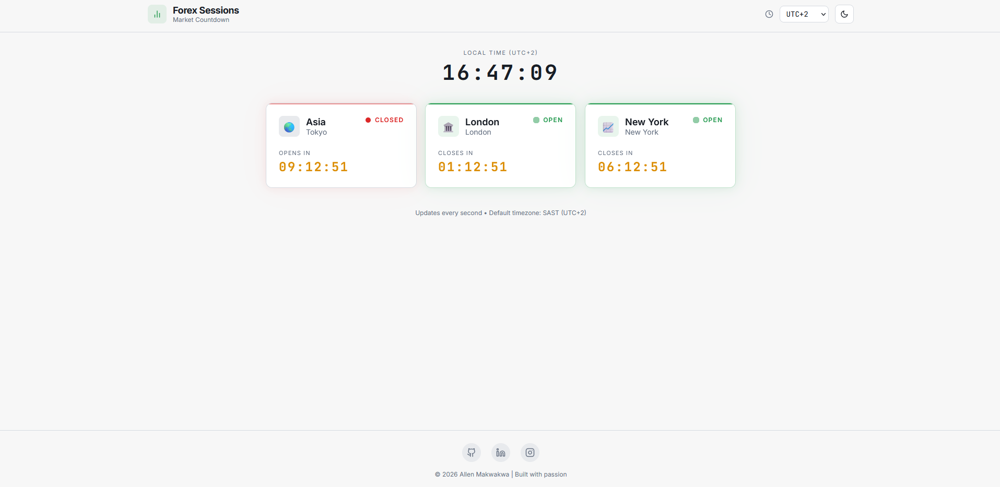
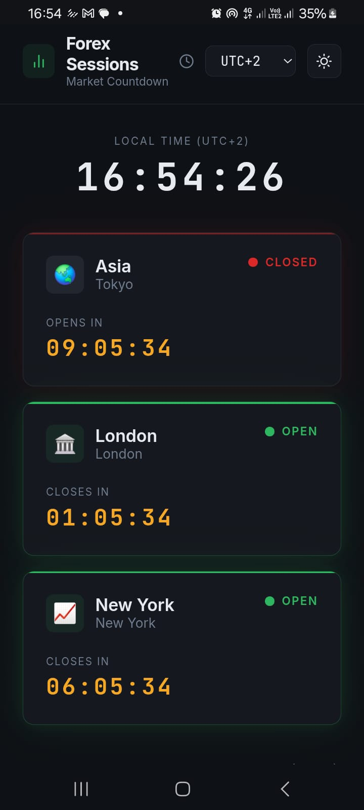

# Forex Market Countdown

**Live Demo:** 🌐 [https://marketcountdown.netlify.app](https://marketcountdown.netlify.app)

A clean, real-time **Forex Market Session Countdown** web app built with pure **HTML**, **CSS**, and **JavaScript** — no frameworks, no dependencies.

It displays the status (Open / Closed) of the three major Forex sessions — **Asia (Tokyo)**, **London**, and **New York** — with live countdowns showing time remaining until close (when open) or until open (when closed).  
This version is optimized and simplified for **South African Standard Time (SAST / UTC+2)**.

## Features

- Real-time status for the three main Forex sessions: **Asia**, **London**, **New York**
- Clear **Open** / **Closed** indicators with color coding
- Live countdown timer for time left to session close or next open
- Displays current local time in **SAST**
- Visual session icons and status badges for quick scanning
- Auto-updates every second
- Fully responsive design — works great on mobile, tablet, and desktop
- Extremely lightweight (~few KB) and fast-loading

## Screenshots

### Desktop View

### Mobile View (responsive design)

Feel free to bookmark it or add it to your trading dashboard!

